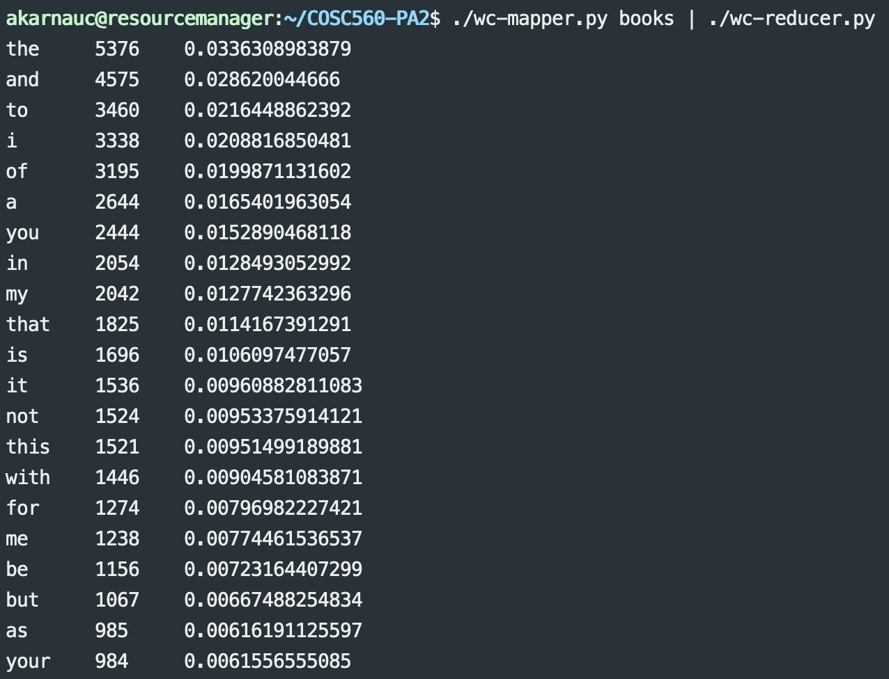
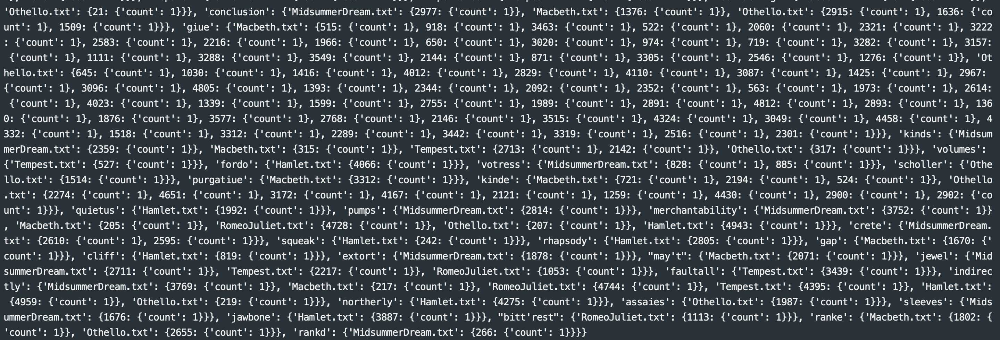
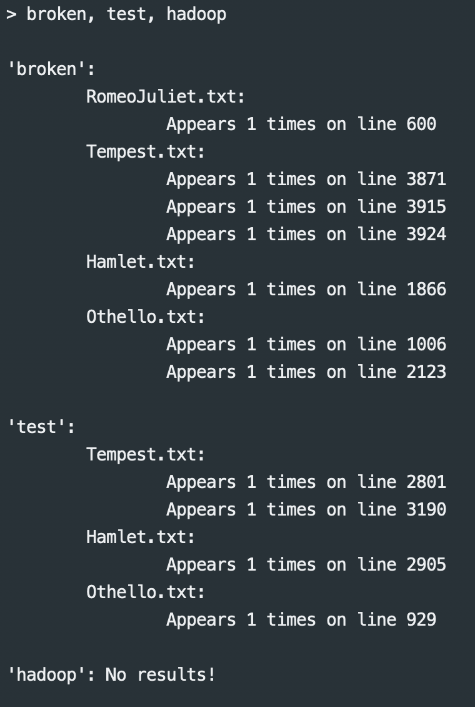

# COSC 560 Programming Assignment 2
## Dakota Sanders & Andrey Karnauch

### Express Installation

To begin, first set up a hadoop instance on `cloudlab`. Use the default configuration with the "Physical Nodes" box checked.

Then, copy the repository by executing the following command while SSH'ed into your hadoop resource manager:

```
git clone https://github.com/dsande30/COSC560-PA2
```

We have created a shell script that will handle the installation process in the Hadoop File System. To run these scripts, execute the following commands:

```
cd COSC560-PA2
chmod +x run.sh
source ./run.sh
```

This script handles setting the environment variables for Java and Hadoop, setting up the Hadoop File System with the proper files, and executing the MapReduce functions. The script should complete with a prompt for our query program. You should see the following after its execution:

```
Starting the Inverted Index Querier, search for a single word or multiple words!
Either enter a single word (i.e. hamlet) or multiple words separated by commas (i.e. hamlet, broken, today)
Escape character is q or Q
>
```

From here, enter any list of comma separated words to query their locations in the corpus.

### The Corpus
For the purposes of this experiment, we have selected our corpus to be 6 selected works from Shakespeare. To modify the corpus, either add or remove text files from the `books/` directory. The program parses these files to create the inverted index. 

### The Code
Our program consists of two major MapReduce functions and one helper function.

#### Function 1: Stopword Identifier
The purpose of the stopword identifier is to calculate the most common words found within the given corpus, and based on a set threshold, exclude these words from being queried. For example, if the threshold is set to exclude the top 50\% most common words, then any of those words would be excluded from the query.

After running the shell script, a list of generated stopwords can be found within the `stop_words.txt` file.

The function works in two parts:

The mapper function, `wc-mapper.py`, works by reading a **directory** name as a command line argument. In our case, this argument is provided as the `books` directory. For each file, it iterates through every word in the file and checks it against a regular expression filtering out all non-word values. We allow for apostrophes to include conjunctions, and the program is case-insensitive.

The reducer function, `wc-reducer.py`, works by reading in the results of the mapper function and creating a dictionary with the word as the key, and its number of occurances as the value. Once this dictionary is created, we sort the keys based on the total percentage of words in the corpus, and output the top 50\% as stopwords. We chose 50\% as our threshold because it captures the most common stopwords without sacrificing many important words. This value, however, is arbitrary and may not be representative of other corpuses. Furthermore, because our corpus comes from the Gutenberg library, we add any values containing the string `gutenberg` to the list of stopwords.

To test this function locally without the Hadoop File System, run the following command:

```
./wc-mapper.py books | ./wc-reducer.py
```

where `books` is a directory containing the corpus of text files, and `wc-mapper.py` and `wc-reducer.py` are the executables.

An example of the output is: 
where the first column shows the word, the second column shows the number of times it appears in the whole corpus, and the last column shows the frequency of the word.

#### Function 2: Inverted Index
The inverted index function is also split into a mapper, `ii-mapper.py`, and a reducer, `ii-reducer.py`.

The purpose of creating an inverted index is to generate a list of pairings between words and their locations. For example, if the string `Hello world` appears in the file `helloworld.txt` on line 1, an inverted index would output:

```
hello > helloworld.txt line 1
world > helloworld.txt line 1
```

The mapper function works by first reading in the previously generated stopword list. This list is used to ensure only important data is presented to the user. From there, it steps through the given directory and reads the data. It then outputs the name of the document, each word in the document, and the line that word appears on, all separated by tabs. For example:

```
helloworld.txt  hello   1
helloworld.txt  world   1
```

The reducer function works by reading the output of the mapper on `stdin`. It then creates a nested dictionary containing the document name, the word, the line number, and the number of occurances of that word on the given line. It then outputs these values to `stdout`.

To test the Inverted Index MapReduce function locally, you can execute the following command:
```
./ii-mapper.py books example-output/stop_words.txt | ./ii-reducer.py
```
where `books` is the directory containing text files of the corpus and `stop_words.txt` is the output from the previous stopword MapReduce job (an example one is included for local testing). This command will output a large, nested dictionary to `stdout`. An example of this output is shown here: 

#### The Query Program
The query program is a simple way to query the final result of the inverted indexer. The program takes the output of the Inverted Index MapReduce job previously and reads in the dictionary. From there, a user is able to search for a single word or a list of comma-separated words in the corpus. The query program outputs the searched for words along with the documents they appear in, which lines they appear on, and the number of times they appear on that line. The query program is case-insensitive and also indicates empty result sets (i.e. the word does not exist in the corpus). It can be run and tested locally using the command:
```
./query.py example-output/inverted_index.txt
```
where inverted_index.txt is the result from the Inverted Index MapReduce job (an example one is include for local testing). Example output from the query program is showing below 

#### Additional Comments
All of the Hadoop streaming commands can be found inside the `run.sh` script. For documentation purposes, we will include the two Hadoop streaming commands here as well. To run the stop word generator on Hadoop:
```
hadoop jar /usr/local/hadoop-2.7.6/share/hadoop/tools/lib/hadoop-streaming-2.7.6.jar -files wc-mapper.py,wc-reducer.py,books -mapper 'wc-mapper.py books' -reducer wc-reducer.py -input /tmp/ta_demo/dummy.txt -output /tmp/ta_demo/wc-out
```
To run the inverted index creator on Hadoop:
```
hadoop jar /usr/local/hadoop-2.7.6/share/hadoop/tools/lib/hadoop-streaming-2.7.6.jar -files ii-mapper.py,ii-reducer.py,books,stop_words.txt -mapper 'ii-mapper.py books stop_words.txt' -reducer ii-reducer.py -input /tmp/ta_demo/dummy.txt -output /tmp/ta_demo/ii-out
```
You will notice several command line arguments in these hadoop-streaming commands. These are all accounted for within the shell script to placed accordingly around the local filesystem and the Hadoop filesystem.